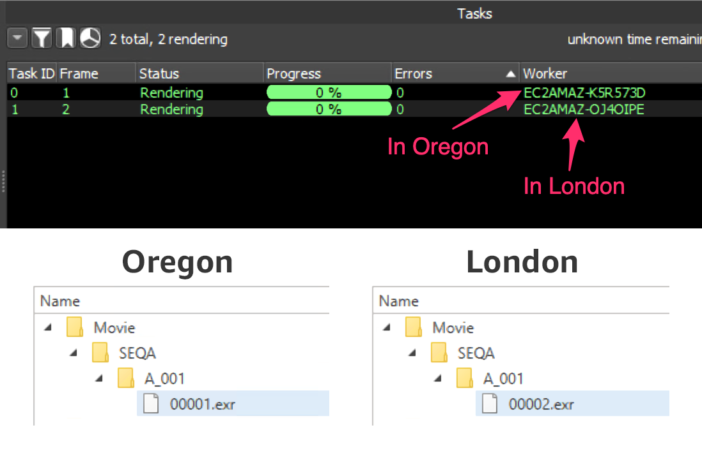

## Hammerspace Event Plugin for Deadline

**Note**: This plugin required Deadline 10.3 or later.

### Overview

[Hammerspace](https://hammerspace.com/) is a global file system solution that allows multiple storage types in different locations to share a single global namespace. In relation to Deadline and a render farm, this means we can take advantage of the global AWS network to render anywhere in any region, and still have access to the results from all other regions. 

For example if Deadline is set up to manage render nodes in both AWS Oregon (us-west-2) and AWS London (eu-west-2) regions, tasks from the same job can be rendered in either region. Hammerspace will then present a unified view of the file system at both locations. 

When using multi-region rendering, there is a race condition that we need to address. The purpose of this plugin is to solve this race condition and avoid any manual intervention.

### The Race Condition

The Hammerspace synchronization process can take a few seconds, and in a render farm setup that can lead to some race conditions. For example if two tasks that are rendering different frames from the same job are picked up at the same time but in different regions, each task could create their own output folder in their respective region. 

After a few seconds, Hammerspace attempts to synchronize the file systems in both regions and finds conflicting folder names. At the moment, the conflict resolution strategy of Hammerspace will create separate folders, identifying the site they were synced from. So we will end up in the following state:

This means that the file paths will be different for different frames of the same sequence, which can be difficult to debug and resolve in a studio pipeline. 

### The Deadline Event Plugin

Most submissions tools that ship with Deadline add `Output Directory` values to the job. 

When the Hammerspace plugin is enabled, it will intercept ALL jobs that have an `Output Directory` and insert a folder creation job as their dependency. This new job will create the folders in a single region, poll Hammerspace until the folders have been synced to all other regions or the plugin times out, then it will release the original submitted job(s).

Once the folders are synced, the render jobs in each region will place their respective frames in the existing folders, avoiding any folder creation collisions. The final state is shown below:

### Plugin Configuration

You can configure the behavior of the plugin from the `Tools > Configure Events` menu in Deadline Monitor (ensure you are in Super User mode).

- Job Options:
    - These are standard Deadline job options that will be applied to the folder-creation job that the plugin will create. This allows you to force these jobs to be picked up by specific render nodes, in specific regions, with specific priorities.
- Iteration Delay (seconds):
    - Number of seconds the plugin will wait after each iteration, before polling Hammerspace again.
- Iteration Count: 
    - Number of times the plugin will poll Hammerspace before timing out and releasing the job. This can be useful if Hammerspace cannot contact a certain site, but you would like to release the render job.

### Advanced Details

- The plugin uses an `Extra Info` Key/Pair called `HS_PLUGIN_GENERATED` on a job to ignore jobs submitted by the plugin itself and to avoid any circular dependency. Any job that has this value set to `True` will be ignored by the plugin.

- Folders that are not under Hammerspace management will be ignored by the plugin. You can see the result of the sync job in its output logs. There are three possible outcomes for each folder:
    - `Sync Complete`: The folder was successfully synced and verified before the job finished
    - `Sync Timed Out`: At the time the plugin timed out, the folder was still not synced to other regions
    - `Sync Skipped`: The folder is not under Hammerspace management so no sync is needed

