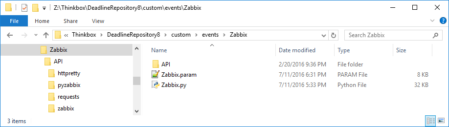
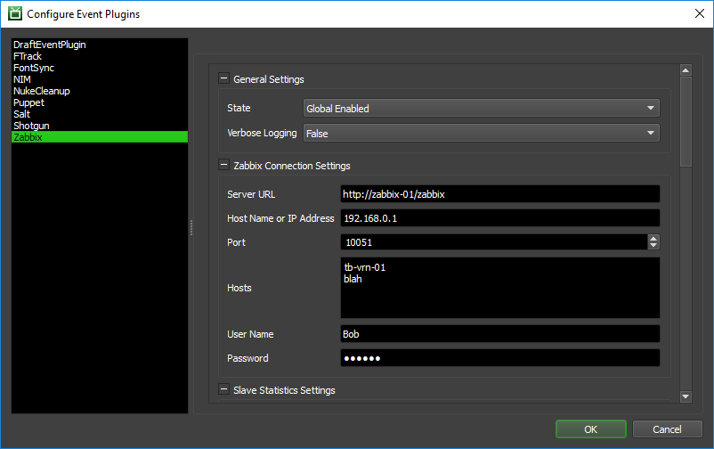
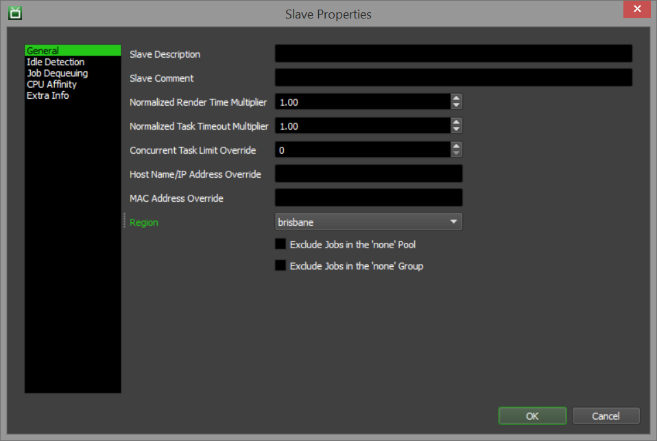
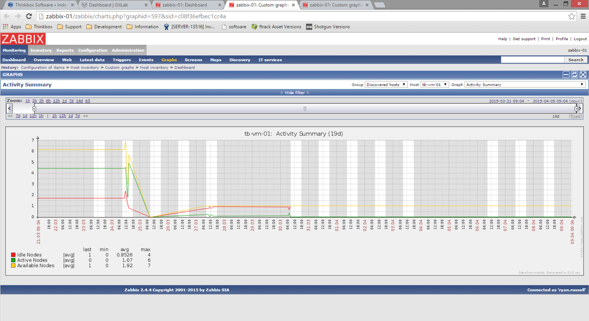
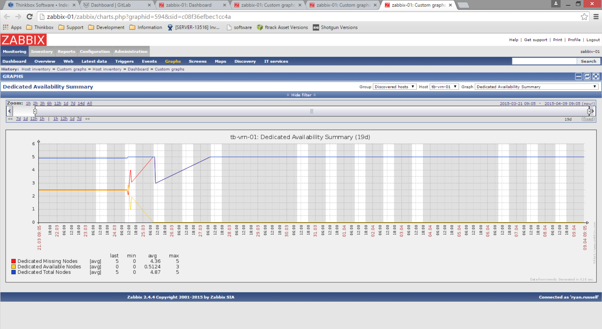

***Zabbix Event Plugin for Deadline***

**Overview:**

The Zabbix event plugin will trigger each time that Pulse performs house
cleaning, which by default is every 60 seconds. This interval can be
adjusted in the House Cleaning section of the Repository Options. In
addition, a Zabbix server must be configured and running with at least
one Host available.

When this event plugin is triggered, it will create the necessary Zabbix
items and graphs for the Host(s) you have chosen if they don’t already
exist, and then it will collect and push statistics to the Zabbix items.
You do not need to create the items or graphs manually.

**Installation:**

To install, unzip the Zabbix.zip file to
\\\\your\\repository\\custom\\events. This should create a folder called
Zabbix, and it should contain 2 x Zabbix.\* plugin files and an API
folder.

Here is a description of the files that are shipped with the Zabbix
event plugin:

-   Zabbix.param: This file defines the controls used by the Deadline
    Monitor to configure the settings that are stored in the
    Deadline database.

-   Zabbix.py: This file contains all the code used to connect to
    Zabbix, generate the items and graphs, and calculate and push
    the statistics. We have added lots of comments to this code to
    explain what the plugin is doing if you’re interested in taking
    a look.

-   API: These are the various Zabbix API modules that the event plugin
    uses to communicate with Zabbix. These have not been modified by us.

**Configuration:**

Open your Deadline Monitor, enter Super User Mode, and select Tools
-&gt; Configure Events. Then select the Zabbix plugin from the list on
the left.

There are many settings you can configure here, but we’ll focus on the
General, Zabbix Connection, Slave and Project Statistics settings. The
rest of the settings are used to help name the various items and graphs
in Zabbix, and can be left as their defaults.

General Settings: These are some general settings for the plugin.

-   State: This must be set to “Global Enabled” for Pulse to trigger
    this event plugin when doing house cleaning.

-   Verbose Logging: If set to True, more information will be logged
    when the event is triggered. You can see this information in
    Pulse’s log.

Zabbix Connection Settings: These are the settings that are used by the
plugin to create items and graphs in Zabbix and to push statistics to
it.

-   Server URL: The URL for your Zabbix server.

-   Host Name or IP Address: The host name or IP address of your
    Zabbix server.

-   Port: The port used to connect to your Zabbix server.

-   Hosts: The hosts that the items and graphs will be created for (one
    per line).

-   User Name: The user name used to connect to your Zabbix server.

-   Password: The password used to connect to your Zabbix server.

Slave Statistics Settings: These settings tell the event plugin where to
get the Slave region information from. See the Slave Regions section
below for more information.

-   Slave Regions: These are the names of the regions for the
    region-specific slave statistics (one per line).

-   Get Region From Extra Info: If set to True, the plugin will pull the
    Slave region information from one of the Extra Info properties in
    the Slave Settings. If set to False, then the region information
    will be pulled from the Slave’s region property in the
    Slave Settings.

-   Region Extra Info Index: If the plugin is pulling the region from
    the Slave’s Extra Info properties, this is the property to pull
    it from. For example, if the slave’s region name is stored in Extra
    Info 1, you would set this to 1.

Project Statistics Settings: These settings tell the event plugin where
to get the Job project information from.

-   Project Names: The names of the projects for the project-specific
    statistics (one per line).

-   Project Extra Info Index: The job’s Extra Info property that
    contains the project information. For example, if you are storing
    the job’s project name in the job’s Extra Info 3 property, you would
    set this to 3.

**Slave Regions:**

There are two ways that you can configure which regions a slave belongs
to. You can either use Deadline’s built in region feature, or you can
simply specify a region name in one of the slave’s Extra Info properties
(similar to how the project name is specified in the job’s Extra Info
properties).

If you just want to use the Extra Info properties, simply select the
slaves you want to add to a specific region in the slave list in the
Monitor, then right-click and select Modify Slave Properties. Select the
Extra Info page and type the name in the field (note which Slave Extra
Info property you have set in your Zabbix event plugin configuration
above). Also, make sure you have set *Get Region From Extra Info* to
True in your plugin configuration.

If you want to use Deadline’s built in Region feature, you must first
create the regions, which can be done in the Region Settings in the
Repository Options. Note that you don’t need to worry about the Cloud
Region section.

After creating the settings, simply select the slaves you want to add to
a specific region in the slave list in the Monitor, then right-click and
select Modify Slave Properties. Select the General page and pick the
appropriate region in the Region drop down box. Also, make sure you have
set *Get Region From Extra Info* to False in your plugin configuration.

**Sample Graphs:**

Here are some examples of graphs that were created by the Zabbix event
plugin.

