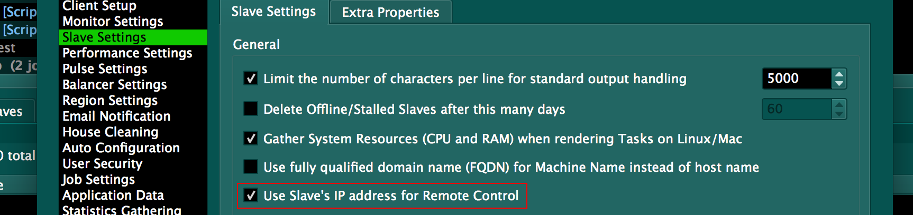

#HostMachineIPAddressOverride#

When a Slave registers itself with the Repository, included in that information is the name of the Host on which the 
Slave is running and the Host's IP address.  Remote commands, such as those issued from the Slaves panel in Deadline 
Monitor, find the Host using standard network routing, such as DNS and/or IP tables.  

When a Slave is running on a Host that is connecting to the Repository over a VPN, it is often the case that the Slave
will register the IP of the standard ethernet adapter instead of the IP of the VPN adapter.  In this case, the desired 
IP can be registerd with the Repository using the  HostMachineIPAddressOverride Slave setting via DeadlineCommand.

The general form of this command is:

    deadlinecommand SetSlaveSetting [hostname] HostMachineIPAddressOverride [ipAddress]
   
In addition to this, in the Repository Settings, in the Slave Settings section, the "Use Slave's IP address for 
Remote Control"  option should be enabled.

Included in this folder are some example scripts (two variants using bash for Linux, and a PowerShell script for 
Windows) that would typically be run as part of the startup of the Host machine. These would be run *after* the VPN 
connection is established.

**IMPORTANT**: These simple example scripts assume you have a tap adapter installed, or in the case of the Windows 
example, that you have correctly stated the service name.  If not, then the wrong IP may be registered and remote
commands will not work.  As always, test first.  You may wish to adapt the examples to your speicfic use case.  

As with all of our examples, we encourage corrections and suggestions for improvments.  Feel free to issue a 
[pull request](https://help.github.com/articles/using-pull-requests/)!

